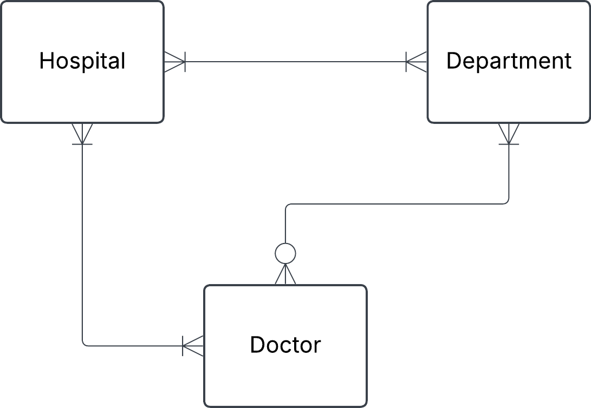
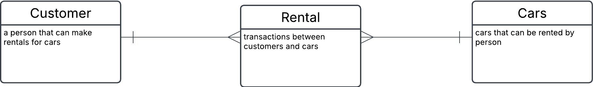
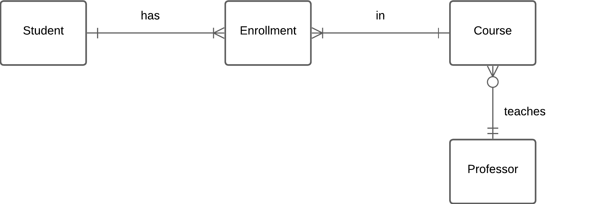

## Exercise 0

## 1. Hospital task 

You have this json data, convert it into three tables: Hospital, Department and Doctor. Fill these tables with data. Do this manually and not programmatically.


```json
{
  "hospital": "Sjukhusstock",
  "address": "Drottninggatan 3, Stockholm",
  "departments": [
    {
      "name": "Kardiologi",
      "doctors": [
        { "id": 1, "name": "Dr. Abra Abrahamson" },
        { "id": 2, "name": "Dr. Erika Eriksson" }
      ]
    },
    {
      "name": "Neurologi",
      "doctors": [{ "id": 3, "name": "Dr. Sven Svensson" }]
    }
  ]
}
```

## Solution 

- identify entities 
- identify relationships and cardinatilities
- create conceptual ERD
- create table


**Initial naive conceptual ERD**




**Initial tables**

Hospital

| hospital_id | name         | address          |
| ----------- | ------------ | ---------------- |
| 1           | Sjukhusstock | Drottninggatan 3 |

Department

| department_id | name       |
| ------------- | ---------- |
| 1             | Kardiologi |
| 2             | Neurologi  |

Doctor

| doctor_id | name                |
| --------- | ------------------- |
| 1         | Dr. Abra Abrahamson |
| 2         | Dr. Erika Eriksson  |
| 3         | Dr. Sven Svensson   |


## 2. Library Bookly

A library called Bookly keeps track of books and members who borrow them. Each book has a title, author, and ISBN number. Each member has a membership ID, name, and contact information. A member can borrow multiple books, but each book can be borrowed by only one member at a time.


a) Identify the entities and attributes for each entity.


b)  Determine the relationship between member and books.


c)  Draw a conceptual ERD using crow foots notation.


# Solution

a) Entities: 

**Book**
- name
- title
- ISBN
- author

**Member**
- first_name
- last_name
- membership_id
- phone
- adress
- email


c) Initial ERD conceptual


<br>


Replaced many-to-many with a bridge table (composite entity)


--- 

## 3. Car rental
This is an ERD conceptual diagram that a database designer and the business stakeholders agreed upon in a car rental company called Carent.

 

a) Describe the entities in this conceptual ERD.

b) Write out the relationship labels.

c) Describe the relationships between the entities (one-to-many, one-to-one and many-to-many).

d) Define the relationship statement for example: "A Customer can have one or more Rentals".


## Solution

a) 

- Customer is a person that can make rentals for cars. 

- Car is the cars that can be rented by person.

- Rental (composite entity) is a transaction between customers and cars.


 


b) see image above


c) 
- Customer to rental (one-to-many)
- Rental to Customer (many-to-one)
- Rental to Car (many-to-one)
- Car to Rental (one-to-many)


d) 
- Each Customer makes one or more Rentals over time
- Each Rental is connected to one Customer
- Each Rental is for one Car
- Each Car can be in several Rentals  


## 5. University


Conceptual ERD 




