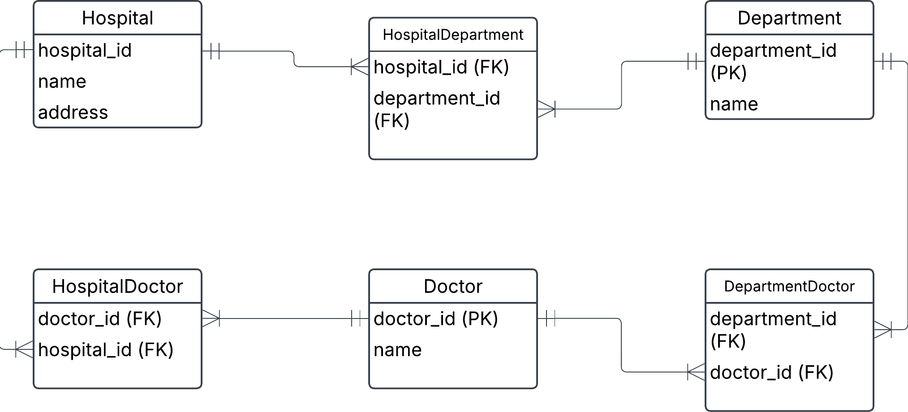
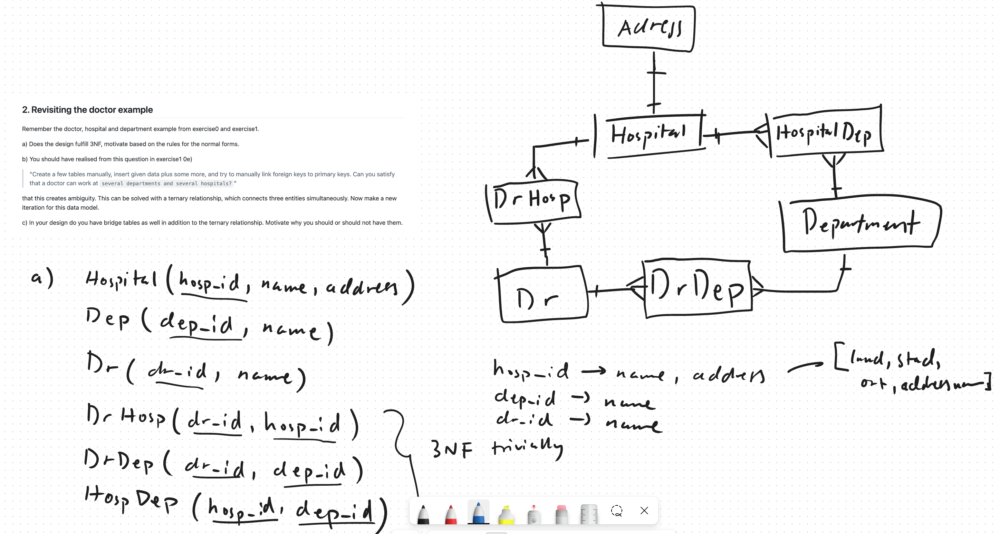
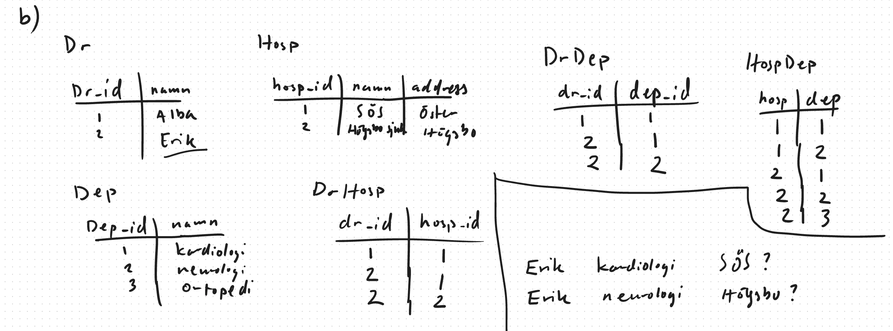

## 0. Ezecream orders

a) Find different problems with this table, so that Ezecream will take you in for internship to fix it for them

b) Does this table satisfy 1NF, 2NF? Motivate.

c) Normalize this table to 3NF, make conceptual diagram and relational schema notation for each relation. Relational schema notation is RelationName(attribute1, attribute2, ...)

d) Now also add price attribute. Think about what would happen when price increases or decreases.

e) Write SQL code to get the total price for Ragnar Lodbrok. Insert data into your tables and test it out.

## Solution

a) order_id, order_date, customer_id, name and address repeats multiple times for different products in the same order. 

c) See exercise2_ezecream.dbml 

d) Order(order_id, order_date, price)
   Customer(customer_id, name, address)
   Product(product_id, name, price)
   CustomerOrder(order_id, customer_id)
   CustomerProduct(product_id, customer_id)

e) see order_exercise2.sql   

    

# 2. Revisiting the doctor example

Remember the doctor, hospital and department example from exercise0 and exercise1.

a)  Does the design fulfill 3NF, motivate based on the rules for the normal forms.

b) You should have realised from this question in exercise1 0e)

"Create a few tables manually, insert given data plus some more, and try to manually link foreign keys to primary keys. Can you satisfy that a doctor can work at several departments and several hospitals?"

that this creates ambiguity. This can be solved with a ternary relationship, which connects three entities simultaneously. Now make a new iteration for this data model.

c) In your design do you have bridge tables as well in addition to the ternary relationship. Motivate why you should or should not have them.

# Solution 

a) 

b) 